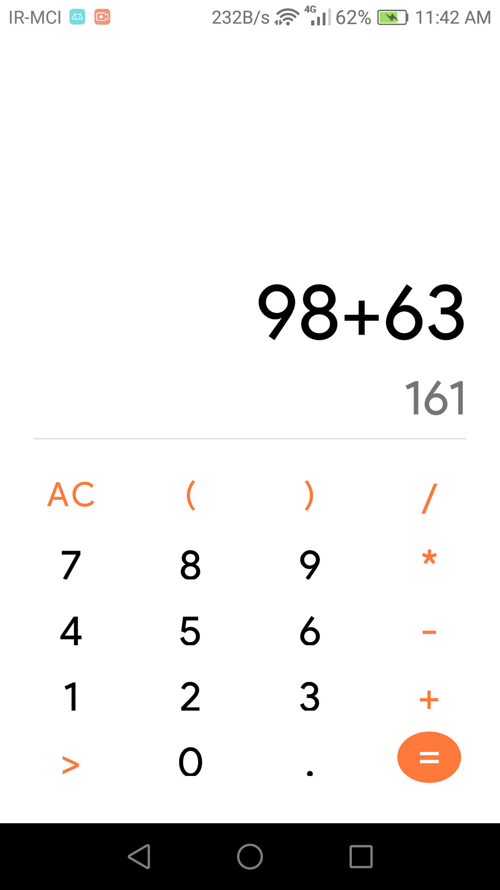

# Calculator
This is my first project written in Kotlin. The project is a simple calculator that performs the four basic arithmetic operations and can be extended to other mathematical operations and unit conversions.

